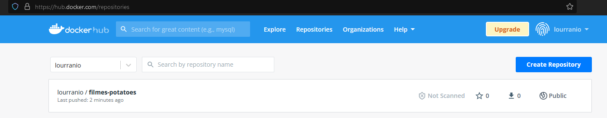

<p align="center">
  <a href="" rel="noopener">
 </a>
</p>

<h3 align="center">Rancher e Docker e Kubenets e Mongo - Tudo Junto</h3>

<div align="center">

[]()
[](/LICENSE)

</div>

---

<p align="center"> RANCHER | KUBERNETS | DOCKER IMAGES | PYTHON | MONGODB
    <br> 
</p>

## 📝 Table of Contents

- [About](#about)
- [Getting Started](#getting_started)
- [Deployment](#deployment)
- [Tests](#tests)
- [Links](#links)

## 🧐 About <a name = "about"></a>

O material é para levantar uma aplicação com os "docker file" em um ambiente kubernets.

Aqui vou usar o Rancher

## 🏁 Getting Started <a name = "getting_started"></a>

1. Instalação do  Rancher Desktop
2. Baixar o projeto.
3. Subir no Visual Studio
4. Criar conta no HUB DOCKER
5. Fazer os deployment

---

<p align="center">
  <a href="" rel="noopener">
 </a>
</p>

- https://docs.rancherdesktop.io/getting-started/installation

---

<p align="center">
  <a href="" rel="noopener">
 </a>
</p>

- https://hub.docker.com/

---

## 🔧 COMANDOS DE TESTE RANCHER DESKTOP <a name = "tests"></a>

```
# nerdctl image ls
```

```
# nerdctl container ls
```

```
# nerdctl container run <nome-da-imagem>
  (exemplos)
  # nerdctl container run -it ubuntu
  # nerdctl container run ngnix
    # nerdctl container run -d -p 8080:80 nginx
```

```
# nerdctl container stop <id-container>
```

## 🚀 Deployment <a name = "deployment"></a>

1. Voce Cria uma imagem

```
nerdctl build -t <nome-dockerhub/<nome-aplicacao:<versao>>>
nerdctl build -t lourranio/filmes:v1
```

1.1

```
nerdctl build -t lourranio/filmes:v1 .
```

2. Voce faz o login no terminal do dockerhub

```
nerdctl login
```

3. Faz o push da imagem para o dockerhub

```
nerdctl push lourranio/filmes-potatoes:v1
```

4. Faz o push da imagem para o dockerhub

```
nerdctl push lourranio/filmes-potatoes:v1
```

<p align="left">
  <a href="" rel="noopener">
 </a>
</p>

5. Subir a aplicação

```
nerdctl push lourranio/filmes-potatoes:v1
```

<p align="left">
  <a href="" rel="noopener">
 </a>
</p>

>

Explicação:

- 1 Primeiro voce gera a imagem
- 2 Faz o push para o dockerhub

Detalhes:

- `nerdctl image ls` é igual a `nerdctl images`

## ⛏️ Links <a name = "links"></a>

- [hubdocker](https://hub.docker.com/) - Docker Images
- [rancherdesktop](https://rancherdesktop.io//) - Conteiner Framework
